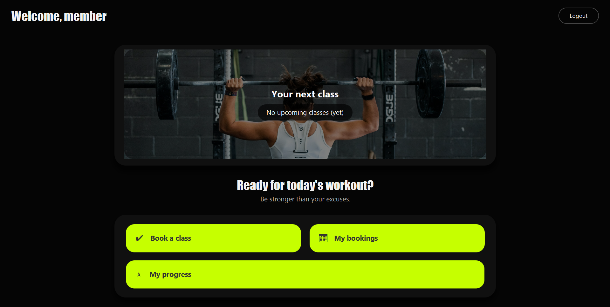
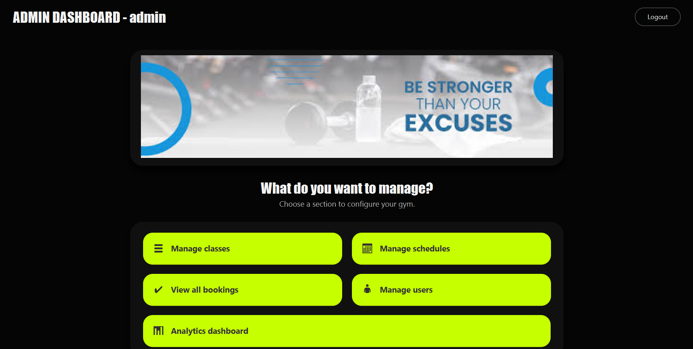
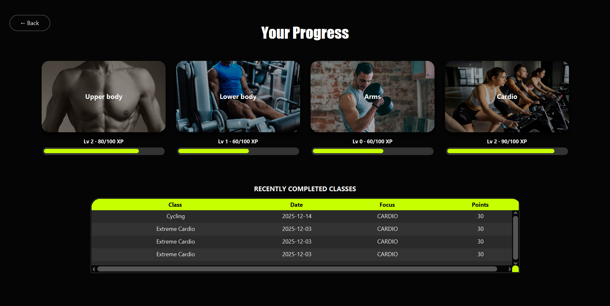
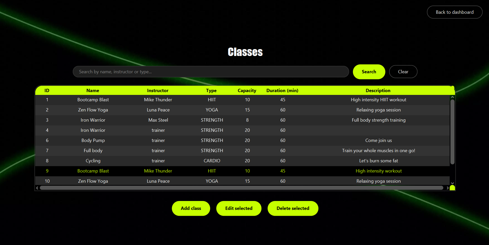

# GymClass Booking System

> Portfolio fork of a team project. Original repository: <[LINK TO ORIGINAL](https://github.com/adriFCM/Gym_Project)>
> My contributions are highlighted below.

A JavaFX + SQLite desktop application for managing gym group classes, bookings and member progress.

- **Admins** manage users, classes and schedules.
- **Trainers** mark attendance and award XP.
- **Members** book classes and track their fitness progress.

## My contributions (Beatriz Martín)
- Designed and implemented core **interfaces** and improved the **repository/service layer structure** to support clean separation of concerns.
- Refactored and organized the codebase to keep a consistent **OOP design** across domain, repository and service modules.
- Implemented and maintained multiple **JavaFX controllers** and UI flows across **Admin / Trainer / Member** views (navigation, state handling and visuals).
- Supported integration between UI and persistence logic (controller → service → repository) to ensure reliable data operations.

Evidence (optional):
- PRs: <[link to pr link filtered by author](https://github.com/adriFCM/Gym_Project/pulls?q=author%3Abeamartin27)>
- Commits: <[link to commits page filtered by author](https://github.com/adriFCM/Gym_Project/commits/main/?author=beamartin27)>

## Screenshots





---

## 1. Tech Stack

- **Language:** Java 17+
- **UI:** JavaFX (FXML)
- **Build tool:** Maven
- **Database:** SQLite (file-based, created automatically)

---

## 2. How to Run the Application

### 2.1. Running from an IDE (IntelliJ / Eclipse)

1. Make sure you have **JDK 17+** installed.
2. Open the project as a **Maven** project.
3. Let Maven download dependencies (`mvn clean install` or via the IDE).
4. Set the run configuration to start the class:
```text
   com.gym.AppMain
```
5. Run the application.

The SQLite database file will be created automatically on first launch, and demo data (users, classes, schedules) will be seeded.

### 2.2. Running from the command line (jar)

Make sure you have the JavaFX SDK installed.

Example (Windows):
```bash
java --module-path C:\openjfx-21.0.9_windows-x64_bin-sdk\javafx-sdk-21.0.9\lib ^
     --add-modules javafx.controls,javafx.fxml ^
     -jar Gym_Project.jar
```

Adjust the --module-path to the location of your JavaFX SDK (...\javafx-sdk-XX\lib).

---

## 3. Database

- **Database:** SQLite file (path configured in `SqliteDatabaseManager`).
- **Tables created on startup:**
    - `users`
    - `classes`
    - `class_schedule`
    - `bookings`
    - `fitness_progress`
- **Demo data seeded:**
    - default admin/trainer/member users
    - sample classes and schedules

You do not need to create tables manually; they are created in code.

---

## 4. Default Credentials

On first run, the system seeds three default accounts:

### Admin
- **Username:** `admin`
- **Password:** `admin123`

### Trainer
- **Username:** `trainer`
- **Password:** `trainer123`

### Member
- **Username:** `member`
- **Password:** `member123`

Use these to log in and explore the different dashboards.

---

## 5. Main Features

### Admin

- Manage users (create/update/delete).
- Create and edit Gym classes (name, instructor, type, capacity, duration).
- Create and edit schedules for classes (date/time, available spots).

### Trainer

- View schedules and bookings for their classes.
- Mark member attendance for a given class.
- Award XP to members based on class type (HIIT, YOGA, STRENGTH, CARDIO).
- Prevent duplicate XP for the same booking (XP is given only once per attended class).

### Member

- Browse available schedules (only future classes with free spots).
- Book and cancel classes.
- View **My Bookings**.
- See a **Progress** screen:
    - XP and Level for Upper body, Lower body, Arms and Cardio.
    - Recently completed classes and the XP gained.

---

## 6. Project Structure (High Level)
```text
src/main/java/com/gym
  ├─ AppMain.java          // JavaFX entry point
  ├─ AppConfig.java        // Wiring of DB, repositories, services, demo seed
  ├─ domain/               // User, GymClass, ClassSchedule, Booking, FitnessProgress
  ├─ repository/           // Repository interfaces
  ├─ repository/sqlite/    // SQLite implementations + SqliteDatabaseManager
  ├─ service/              // AuthService, ClassService, BookingService, ProgressService
  ├─ ui/controllers/       // JavaFX controllers (login, dashboards, progress, etc.)
  └─ utils/                // SceneManager, SessionManager, demo seeding helpers
```

FXML views are located under:
```text
src/main/resources/views/
```

---

## 7. Building the Project

To build with Maven:
```bash
mvn clean package
```

This will:

- Compile the source code.
- Run tests (if present).
- Produce a jar under `target/`.

You can then run that jar as explained in section 2.2.
